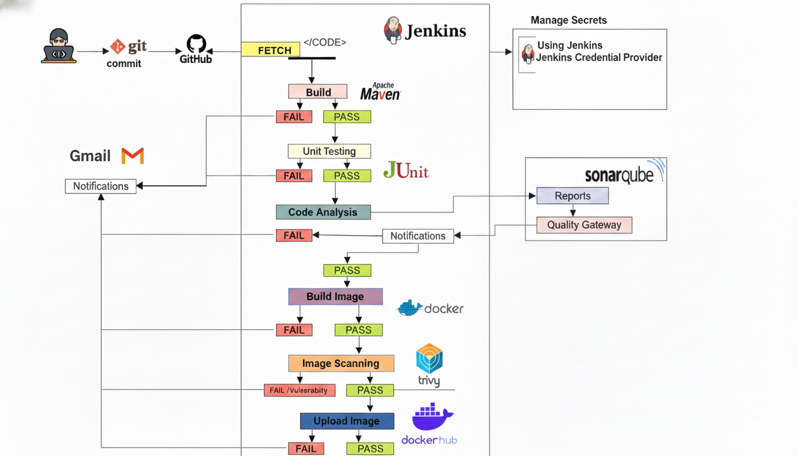
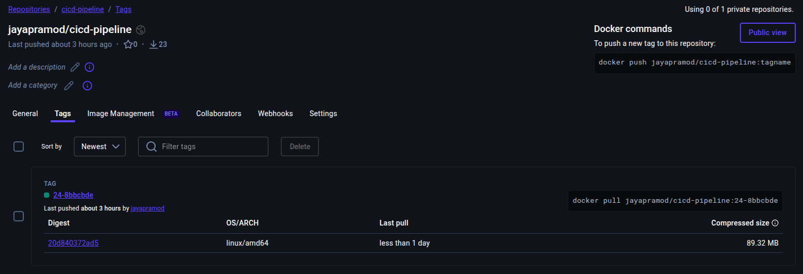
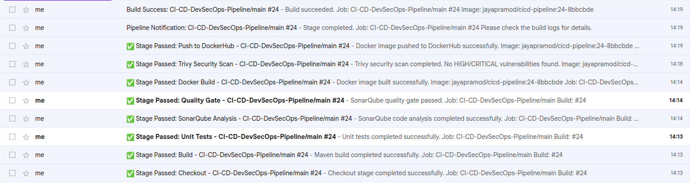

# CI-CD-DevSecOps-Pipeline

This repository is a minimal demo application and CI/CD pipeline scaffold combining Jenkins, Maven, JUnit, SonarQube, Docker, Trivy, and DockerHub. The README below documents every step required to run the pipeline, configure Jenkins, and manage secrets — plus an architecture diagram and instructions for adding screenshots for DockerHub and SMTP configuration.

## Table of contents

- Overview
- Architecture diagram
- Prerequisites
- Step-by-step Jenkins setup
  - Plugins
  - Global config (Sonar, SMTP)
  - Credentials to create
- Pipeline stages explained
- DockerHub and image management (with screenshot placeholder)
- SMTP / Email setup (with screenshot placeholder)
- Run locally (quick checks)
- Troubleshooting
- Next steps

## Overview

This project is a single-repo pipeline (application code + `Jenkinsfile` in the same repository). The Jenkins pipeline performs build, test, SonarQube analysis, quality gate check, Docker build, Trivy scan, and pushes the artifact to DockerHub. Email notifications are sent at stage completion and final status.

## Architecture diagram

Below is a simple Mermaid diagram that visualizes the pipeline flow. If you prefer an image, add `images/architecture.png` to the repository and reference it where noted.

```mermaid
flowchart LR
  A[GitHub Repository] -->|Webhook / Manual| B[Jenkins Multibranch Pipeline]
	B --> C{Stages}
	C --> C1[Checkout]
	C --> C2[Build - mvn package]
	C --> C3[Unit Tests]
	C --> C4[SonarQube Analysis]
	C --> C5[Quality Gate]
	C --> C6[Docker Build]
	C --> C7[Trivy Scan]
	C --> C8[Push to DockerHub]
  C8 --> D[DockerHub Registry]
  C7 --> E[Security Scan Reports]
  C4 --> F[SonarQube Server]
  B --> G[Email Notifications (SMTP)]
```

If you want a PNG/SVG instead of the Mermaid block, place your diagram at `images/architecture.png`. The README shows the Mermaid by default which renders on platforms that support it (like GitHub). To display the PNG add this Markdown where you want it:



## Prerequisites

- Jenkins (2.x+) with Pipeline support
- Java 17 installed on build agent
- Maven installed or use the Maven image/wrapper
- Docker installed on the agent (for build + Trivy) or use containerized agents
- SonarQube server reachable from Jenkins (optional but recommended)
- DockerHub account and repo
- SMTP credentials or an email relay for `emailext`

Run the quick environment check included in the repo:

```bash
./scripts/check-env.sh
```

## Step-by-step Jenkins setup

Follow these concrete steps in Jenkins (UI) before running the pipeline.

1. Install required plugins (Jenkins → Manage Plugins):
	- Pipeline
	- Git
	- Email Extension (emailext)
	- SonarQube Scanner for Jenkins
	- JUnit plugin
	- (Optional) Docker Pipeline

2. Configure SonarQube server (Jenkins → Manage Jenkins → Configure System → SonarQube servers):
	- Name: `SonarQube` (must match `SONAR_SERVER` in `Jenkinsfile`)
	- Server URL: e.g. `http://sonarqube:9000`
	- Server authentication token: choose the Jenkins credential `sonar-token` (create it first)

3. Configure SMTP (Jenkins → Manage Jenkins → Configure System → Extended E-mail Notification):
	- SMTP server: `smtp.gmail.com` (or your SMTP)
	- SMTP port: `587`
	- Use SMTP Authentication: checked
	- Username: `your-email@example.com`
	- Password: app password or secret
	- Use TLS: checked
	- Set the Jenkins URL in the top-level Configure System (`http://your-jenkins-host:8080/`)

4. Create required credentials (Jenkins → Credentials → System):
	- `sonar-token` — Secret text (Sonar token)
	- `dockerhub-creds` — Username with password (DockerHub username & token/password)
	- (Optional) GitHub PAT or SSH key if your repo is private

5. Create a Multibranch Pipeline job pointing to this repository (the job will detect `Jenkinsfile`).

## Pipeline stages explained

The `Jenkinsfile` contains these stages; below each stage is explained briefly, one by one:

1. Checkout — Jenkins clones the repository into the workspace (uses `scm`) so subsequent stages run against the checked-out code.

2. Build — Runs `mvn -B -DskipTests package` to compile and package the application into a JAR under `target/` (skips tests in this step to speed packaging when desired).

3. Unit Tests — Runs `mvn test` and publishes JUnit XML reports (`target/surefire-reports/*.xml`); test failures fail this stage and are reported in Jenkins and emails.

4. SonarQube Analysis — Executes `mvn sonar:sonar` within `withSonarQubeEnv`, using the `sonar-token` credential to upload code metrics and issues to the SonarQube server.

5. Quality Gate — `waitForQualityGate()` waits for SonarQube to compute the analysis and enforces the configured quality gate; if the gate is not `OK`, the pipeline fails.

6. Docker Build — Builds a Docker image from the repository (reads `Dockerfile`) and tags it using the build number and commit short SHA for traceability.

7. Trivy Scan — Runs Trivy to scan the freshly-built image for vulnerabilities; by default the pipeline fails if HIGH or CRITICAL findings are detected.

8. Push to DockerHub — Authenticates with DockerHub using the `dockerhub-creds` credential, pushes the tagged image to your DockerHub namespace, and logs out.

9. Send Test Email (explicit) — An explicit `emailext` call is included for verifying SMTP/email notifications; successful sends confirm SMTP setup.

10. Post actions / Notifications — The pipeline `post` block sends a final success/failure notification and can be used to add cleanup (e.g., `cleanWs()`), artifact archival, or other global steps.

## DockerHub and image management (screenshot)




## SMTP / Email setup (screenshot)




### Recommended SMTP settings (Gmail example)

- SMTP server: `smtp.gmail.com`
- Port: `587`
- Use SMTP authentication: yes
- Username: your Gmail address
- Password: use an app password (do not use main account password)
- Use TLS: yes

## Run locally (quick checks)

1. Quick environment health check:

```bash
./scripts/check-env.sh
```

2. Build and test locally:

```bash
mvn -B clean package
mvn test
```

3. Run locally:

```bash
mvn spring-boot:run
# open http://localhost:8080/hello
```

4. Build and run Docker image locally:

```bash
docker build -t myname/cicd-pipeline:local-1 .
docker run -p 8080:8080 myname/cicd-pipeline:local-1
```

## Troubleshooting

- Sonar: if you see errors about `waitForQualityGate` or `withSonarQubeEnv`, ensure the SonarQube Scanner plugin is installed and the Sonar server named `SonarQube` is configured in Jenkins.
- Email: if `emailext` fails, check the Extended E-mail Notification settings and test the SMTP credentials using the Jenkins global config test button.
- Docker/Trivy: ensure Docker is installed and the Jenkins agent user can run Docker. Trivy runs by mounting the Docker socket; ensure the agent allows that.
- Tests: if JUnit reports are not found, check `target/surefire-reports/*.xml` for generated files and adjust `junit` path if needed.


